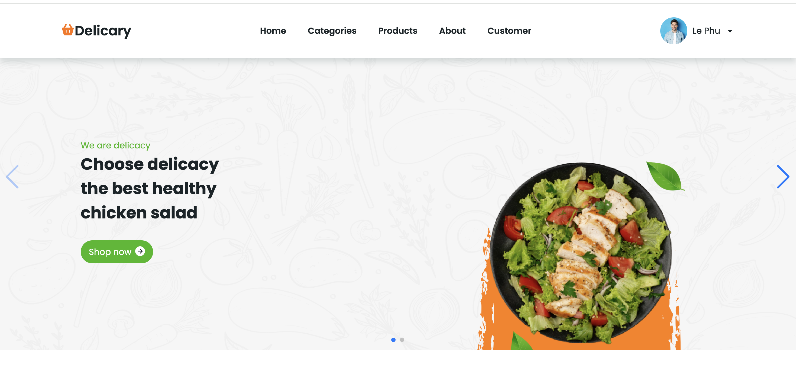
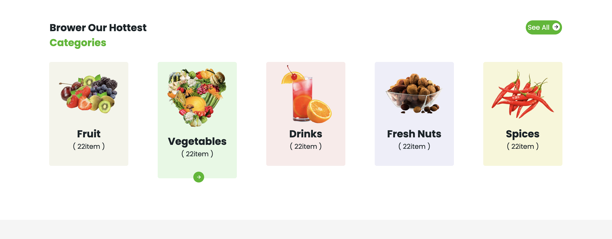
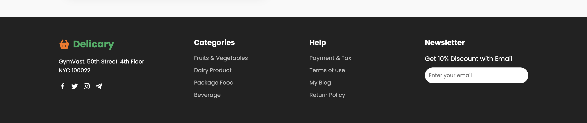

# Delicary Website

  
Một website bán hàng giả lập, hiển thị danh mục sản phẩm, chi tiết sản phẩm, thông tin về công ty và footer.  
Giao diện responsive, dễ nhìn và trực quan.

---

## Demo giao diện

### Header


### Categories


### Products


### About Us


### Footer


---

##  Công nghệ sử dụng

- **HTML5** – cấu trúc website
- **CSS – tạo giao diện đẹp và responsive
- **JavaScript** – tương tác động với người dùng

---

## Cài đặt & Chạy thử

1. Clone repo về máy:

```bash
git clone https://github.com/lephu2k6/Delicary-Website.git
cd Delicary-Website
